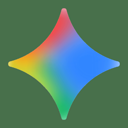
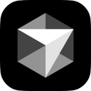
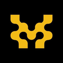
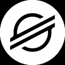

<h1 align="center">Mark Siazon 👋</h1>

<strong>Product Designer & Full-Stack Developer</strong>

<em>Proof-backed products · AI · Mobile · Web3</em>

  
  
  

---

<h3 align="center">Featured Work</h3>

<table width="100%">
  <tr>
    <td align="center" width="33%">
       <b>HireProof</b> AI trust & safety
    </td>
    <td align="center" width="33%">
       <b>Stellaroid Earn</b> Web3 credential proof
    </td>
    <td align="center" width="33%">
       <b>ResQLink</b> Offline-first emergency tech
    </td>
  </tr>
</table>

  <a href="https://www.marksiazon.dev/projects">All projects</a> ·
  <a href="https://www.marksiazon.dev/proof">Proof matrix</a> ·
  <a href="https://www.marksiazon.dev/lab">Lab</a>

Lab: <a href="https://github.com/Iron-Mark/qwen-ui-lab">qwen-ui-lab</a> · <a href="https://www.marksiazon.dev/projects/palengkepay">PalengkePay</a> · <a href="https://www.marksiazon.dev/projects/gawainyah">GawainYah</a>

---

<h3 align="center">Stack & Fields</h3>

<table width="100%" align="center">
  <tr align="center"><td colspan="5"><b>🌐 WEB</b></td></tr>
  <tr align="center">
    <td> HTML5</td>
    <td> CSS3</td>
    <td> JS</td>
    <td> TS</td>
    <td> React</td>
  </tr>
  <tr align="center">
    <td> Next.js</td>
    <td> Vite</td>
    <td> Tailwind</td>
    <td> Bootstrap</td>
    <td> Sass</td>
  </tr>
  <tr align="center"><td colspan="5"><b>📱 MOBILE</b></td></tr>
  <tr align="center">
    <td> Flutter</td>
    <td> React Native</td>
    <td> Kotlin</td>
    <td> Capacitor</td>
    <td> Dart</td>
  </tr>
  <tr align="center">
    <td> Android</td>
    <td colspan="4">Wear OS · cross-platform apps</td>
  </tr>
  <tr align="center"><td colspan="5"><b>🧭 TANSTACK</b></td></tr>
  <tr align="center">
    <td> TanStack</td>
    <td colspan="4">Query · Router · Table · Form · data-driven UI</td>
  </tr>
  <tr align="center"><td colspan="5"><b>🎮 GAME DEV</b></td></tr>
  <tr align="center">
    <td> Unity</td>
    <td colspan="4">Interactive experiences · gameplay UI · prototyping</td>
  </tr>
  <tr align="center"><td colspan="5"><b>🎨 UI / UX</b></td></tr>
  <tr align="center">
    <td> Figma</td>
    <td colspan="4">Design systems · user research · accessibility · product UI</td>
  </tr>
  <tr align="center"><td colspan="5"><b>🤖 AI</b></td></tr>
  <tr align="center">
    <td> Python</td>
    <td> FastAPI</td>
    <td> PyTorch</td>
    <td colspan="2">LLM apps · AI agents · trust & safety · ML UX</td>
  </tr>
  <tr align="center"><td colspan="5"><b>🛠️ AI ASSISTED DEVELOPMENT WORKFLOW</b></td></tr>
  <tr align="center">
    <td> ChatGPT</td>
    <td> Claude</td>
    <td> Gemini</td>
    <td> Copilot</td>
    <td> Qwen</td>
  </tr>
  <tr align="center">
    <td> Cursor</td>
    <td> v0</td>
    <td> Vercel</td>
    <td> Codex</td>
    <td>Prompting · codegen · UI gen · deploy loops</td>
  </tr>
  <tr align="center"><td colspan="5"><b>🌍 WEB3 NETWORKS</b></td></tr>
  <tr align="center">
    <td><a href="https://movementnetwork.xyz/"> Move Network</a></td>
    <td><a href="https://stellar.org/"> Stellar</a></td>
    <td><a href="https://celo.org/"> Celo</a></td>
    <td><a href="https://morph.network/"> Morph</a></td>
    <td>Builder · ecosystem · proof systems</td>
  </tr>
  <tr align="center"><td colspan="5"><b>⛓️ WEB3 · BACKEND · TOOLS</b></td></tr>
  <tr align="center">
    <td> Solidity</td>
    <td> Supabase</td>
    <td> Appwrite</td>
    <td> Node.js</td>
    <td> Git</td>
  </tr>
</table>

<em>Web · Mobile · Game · UI/UX · AI · Web3 · AI-assisted workflows — proof-backed across the stack</em>

---

- **Design → Code** — Case studies at [marksiazon.dev](https://www.marksiazon.dev)
- **Flagship proof** — [HireProof](https://hireproof.tech/portfolio) · [Stellaroid](https://stellaroid.tech) · [ResQLink](https://github.com/UMakLumen/ResQLinkWeb)
- **Also on** — [@mark-siazon](https://github.com/mark-siazon) (FM solutions) · [@Iron-Mark](https://github.com/Iron-Mark) (hackathons / lab)

> A thoughtful interface fosters deeper human–technology connection.

---

  
  
  
  
  

<strong>Thanks for stopping by! Check out the links above 😁</strong>

