

  <picture>
    <source type="image/webp" srcset="assets/brand/mark-siazon-product-design-full-stack-profile-banner.webp"/>
    
  </picture>

<h1 align="center">Mark Siazon 👋</h1>

  <picture>
    <source media="(max-width: 540px)" srcset="https://readme-typing-svg.demolab.com/?lines=Product+Designer;Full-Stack+Developer;Product+Engineer;UI%2FUX+Designer;Front-end+Specialist;Developer+x+Designer;Polymath+%2F+Jack+of+All+Trades&font=Fira+Code&pause=1600&center=true&width=320&height=40&color=8B5CF6&random=true&size=18&v=3"/>
    
  </picture>

Product Design Engineer &amp; Full-Stack Developer | UI/UX | React, Next.js, TypeScript | Frontend-Specialist | Tech Enthusiast | Multi-Hackathon Champion | AI Products, Workflows &amp; Design Systems |

Contract · full-time · Philippines &amp; remote · mobile &amp; Web3 · case studies &amp; live demos below

  
  
  

  
  
  
  

---

<!-- PROFILE-INTELLIGENCE:START -->

<h2 align="center">Profile Intelligence</h2>

Deterministic recruiter-fit ranking generated from public proof links, project focus, achievements, and role signals | updated 2026-06-24 | <a href="https://iron-mark.github.io/Iron-Mark/readme-intelligence.json" rel="noopener noreferrer">machine-readable JSON</a>

<table width="100%" style="table-layout:fixed;border-collapse:collapse">
  <colgroup>
    <col width="34%"/>
    <col width="34%"/>
    <col width="32%"/>
  </colgroup>
  <thead>
    <tr>
      <th align="left">Best proof routes</th>
      <th align="left">Why it ranks</th>
      <th align="left">Evidence</th>
    </tr>
  </thead>
  <tbody>
    <tr><td><b><a href="https://www.marksiazon.dev/projects/stellaroid-earn" rel="noopener noreferrer">Stellaroid Earn</a></b> Web3 credential proof on Stellar testnet</td><td>Mobile and Web3 Builder | score 53/100 proof 20 | impact 23 | fit 8 | coverage 2</td><td><a href="https://www.marksiazon.dev/projects/stellaroid-earn" rel="noopener noreferrer">case study</a> | <a href="https://stellaroid.tech" rel="noopener noreferrer">live</a></td></tr>
    <tr><td><b><a href="https://www.marksiazon.dev/projects/baybayinscribe" rel="noopener noreferrer">BaybayInscribe</a></b> Baybayin ML and cultural education UX</td><td>Product Design Engineer | score 50/100 proof 17 | impact 23 | fit 6 | coverage 4</td><td><a href="https://www.marksiazon.dev/projects/baybayinscribe" rel="noopener noreferrer">case study</a> | <a href="https://huggingface.co/gilas/baybayinscribe" rel="noopener noreferrer">model</a></td></tr>
    <tr><td><b><a href="https://www.marksiazon.dev/projects/resqlink" rel="noopener noreferrer">ResQLink</a></b> Offline-first emergency response platform</td><td>Full-Stack Developer | score 48/100 proof 20 | impact 23 | fit 3 | coverage 2</td><td><a href="https://www.marksiazon.dev/projects/resqlink" rel="noopener noreferrer">case study</a> | <a href="https://github.com/UMakLumen/ResQLinkWeb" rel="noopener noreferrer">repo</a></td></tr>
  </tbody>
</table>

AI Workflow Builder: HireProof, LexInSight | Mobile and Web3 Builder: Stellaroid Earn, Kudlit | Full-Stack Developer: qwen-ui-lab, Smart Profile

<!-- PROFILE-INTELLIGENCE:END -->

---

<h2 align="center">Featured Work</h2>

<table width="100%" style="table-layout:fixed;min-width:680px;border-collapse:collapse">
  <colgroup>
    <col width="33%"/>
    <col width="33%"/>
    <col width="33%"/>
  </colgroup>
  <tr>
    <td align="center" width="33%">
      <a href="https://www.marksiazon.dev/projects/hireproof" rel="noopener noreferrer" aria-label="HireProof case study">
        <picture>
          <source type="image/webp" srcset="assets/projects/hireproof/cover.webp"/>
          
        </picture>
      </a> <b><a href="https://www.marksiazon.dev/projects/hireproof" rel="noopener noreferrer">HireProof</a></b> AI trust & safety <a href="https://hireproof.tech/portfolio" rel="noopener noreferrer" aria-label="HireProof live project">Live ↗</a>
    </td>
    <td align="center" width="33%">
      <a href="https://www.marksiazon.dev/projects/stellaroid-earn" rel="noopener noreferrer" aria-label="Stellaroid Earn case study">
        <picture>
          <source type="image/webp" srcset="assets/projects/stellaroid-earn/cover.webp"/>
          
        </picture>
      </a> <b><a href="https://www.marksiazon.dev/projects/stellaroid-earn" rel="noopener noreferrer">Stellaroid Earn</a></b> Web3 credential proof <a href="https://stellaroid.tech" rel="noopener noreferrer" aria-label="Stellaroid Earn live project">Live ↗</a>
    </td>
    <td align="center" width="33%">
      <a href="https://www.marksiazon.dev/projects/resqlink" rel="noopener noreferrer" aria-label="ResQLink case study">
        <picture>
          <source type="image/webp" srcset="assets/projects/resqlink/cover.webp"/>
          
        </picture>
      </a> <b><a href="https://www.marksiazon.dev/projects/resqlink" rel="noopener noreferrer">ResQLink</a></b> Offline-first emergency tech <a href="https://github.com/UMakLumen/ResQLinkWeb" rel="noopener noreferrer" aria-label="ResQLink repository">Repo ↗</a>
    </td>
  </tr>
  <tr>
    <td align="center" width="33%">
      <a href="https://www.marksiazon.dev/projects/lexinsights" rel="noopener noreferrer" aria-label="LexInSight case study">
        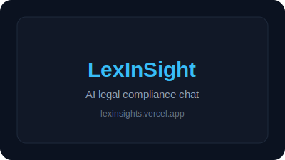
      </a> <b><a href="https://www.marksiazon.dev/projects/lexinsights" rel="noopener noreferrer">LexInSight</a></b> AI legal compliance chat <a href="https://lexinsights.vercel.app" rel="noopener noreferrer" aria-label="LexInSight live app">Live ↗</a> · <a href="https://github.com/Iron-Mark/Hackathon-LexInsights" rel="noopener noreferrer" aria-label="LexInSight repository">Repo ↗</a>
    </td>
    <td align="center" width="33%">
      <a href="https://www.marksiazon.dev/projects/good-to-live" rel="noopener noreferrer" aria-label="Good To Live case study">
        <picture>
          <source type="image/webp" srcset="assets/projects/good-to-live/cover.webp"/>
          
        </picture>
      </a> <b><a href="https://www.marksiazon.dev/projects/good-to-live" rel="noopener noreferrer">Good To Live</a></b> Client web launch & SEO <a href="https://www.goodtolivepodcast.com" rel="noopener noreferrer" aria-label="Good To Live live site">Live ↗</a>
    </td>
    <td align="center" width="33%">
      <a href="https://www.marksiazon.dev/projects/flowfit" rel="noopener noreferrer" aria-label="FlowFit case study">
        <picture>
          <source type="image/webp" srcset="assets/projects/flowfit/cover.webp"/>
          
        </picture>
      </a> <b><a href="https://www.marksiazon.dev/projects/flowfit" rel="noopener noreferrer">FlowFit</a></b> Wear OS · health & sensors <a href="https://www.marksiazon.dev/projects/flowfit" rel="noopener noreferrer" aria-label="FlowFit case study">Case study ↗</a>
    </td>
  </tr>
  <tr>
    <td align="center" width="33%">
      <a href="https://www.marksiazon.dev/projects/palengkepay" rel="noopener noreferrer" aria-label="PalengkePay case study">
        <picture>
          <source type="image/webp" srcset="assets/projects/palengkepay/cover.webp"/>
          
        </picture>
      </a> <b><a href="https://www.marksiazon.dev/projects/palengkepay" rel="noopener noreferrer">PalengkePay</a></b> Stellar fintech PWA <a href="https://palengke-pay.vercel.app" rel="noopener noreferrer" aria-label="PalengkePay live app">Live ↗</a>
    </td>
    <td align="center" width="33%">
      <a href="https://www.marksiazon.dev/projects/gawainyah" rel="noopener noreferrer" aria-label="GawainYah case study">
        <picture>
          <source type="image/webp" srcset="assets/projects/gawainyah/cover.webp"/>
          
        </picture>
      </a> <b><a href="https://www.marksiazon.dev/projects/gawainyah" rel="noopener noreferrer">GawainYah</a></b> MiniPay AI utility <a href="https://gawainyah-minipay.vercel.app" rel="noopener noreferrer" aria-label="GawainYah live app">Live ↗</a>
    </td>
    <td align="center" width="33%">
      <a href="https://www.marksiazon.dev/projects/baybayinscribe" rel="noopener noreferrer" aria-label="BaybayInscribe case study">
        <picture>
          <source type="image/webp" srcset="assets/projects/baybayinscribe/cover.webp"/>
          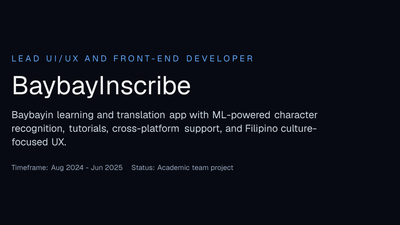
        </picture>
      </a> 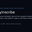<b><a href="https://www.marksiazon.dev/projects/baybayinscribe" rel="noopener noreferrer">BaybayInscribe</a></b> Baybayin ML · cultural education UX <a href="https://huggingface.co/gilas/baybayinscribe" rel="noopener noreferrer" aria-label="BaybayInscribe Hugging Face model">Model ↗</a> · <a href="https://www.marksiazon.dev/projects/baybayinscribe" rel="noopener noreferrer" aria-label="BaybayInscribe case study">Case study ↗</a>
    </td>
  </tr>
</table>

  <a href="https://www.marksiazon.dev/projects" rel="noopener noreferrer">All projects</a> ·
  <a href="https://iron-mark.github.io/Iron-Mark/lab/" rel="noopener noreferrer">Lab index</a> ·
  <a href="https://www.marksiazon.dev/proof" rel="noopener noreferrer">Proof matrix</a> ·
  <a href="https://www.marksiazon.dev/achievements" rel="noopener noreferrer">Achievements</a>

---

<h2 align="center">GitHub Activity</h2>

Public contribution snapshot for <a href="https://github.com/Iron-Mark">@Iron-Mark</a> · updated daily

  
  

  
  

---

<h2 align="center">Tech Stack</h2>

Core tools I ship with · <a href="public/STACK.md">full stack reference (113 tools)</a> · <a href="https://www.marksiazon.dev/projects">project proof</a>

<table width="100%">
  <colgroup>
    <col width="12.5%"/><col width="12.5%"/><col width="12.5%"/><col width="12.5%"/>
    <col width="12.5%"/><col width="12.5%"/><col width="12.5%"/><col width="12.5%"/>
  </colgroup>
  <tr align="center"><td colspan="8"><b>Core stack</b> · <b>Design</b> · <b>Web</b> · <b>Mobile</b> · <b>AI workflow</b> · <b>Web3</b> · <b>Ship</b></td></tr>
  <tr align="center">
    <td> Figma</td>
    <td> React</td>
    <td> Next.js</td>
    <td> TypeScript</td>
    <td><a href="https://tailwindcss.com/docs/installation/using-vite" rel="noopener noreferrer">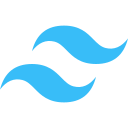 Tailwind</a></td>
    <td> Flutter</td>
    <td>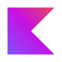 Kotlin</td>
    <td><a href="https://cursor.com/docs/get-started/quickstart" rel="noopener noreferrer">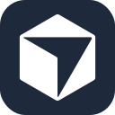 Cursor</a></td>
  </tr>
  <tr align="center">
    <td><a href="https://docs.github.com/en/copilot/get-started" rel="noopener noreferrer">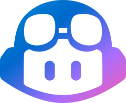 Copilot</a></td>
    <td> Claude</td>
    <td><a href="https://stellar.org/" rel="noopener noreferrer">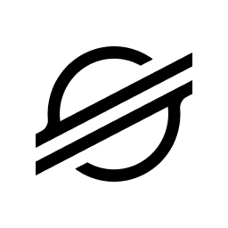 Stellar</a></td>
    <td><a href="https://celo.org/" rel="noopener noreferrer"> Celo</a></td>
    <td> Python</td>
    <td> Supabase</td>
    <td>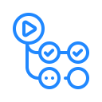 CI/CD</td>
    <td> Docker</td>
  </tr>
</table>

  
Extended stack · deeper cuts per domain

  

  <table width="100%">
    <colgroup>
      <col width="11%"/><col width="11%"/><col width="11%"/><col width="11%"/><col width="11%"/>
      <col width="11%"/><col width="11%"/><col width="11%"/><col width="11%"/>
    </colgroup>
    <tr align="center"><td colspan="9"><b>Web</b></td></tr>
    <tr align="center">
      <td width="11%"> HTML5</td>
      <td width="11%"> CSS3</td>
      <td width="11%"> JS</td>
      <td width="11%"> Vite</td>
    </tr>
    <tr align="center"><td colspan="9"><b>Mobile</b> · beyond core Flutter · Kotlin</td></tr>
    <tr align="center">
      <td width="11%">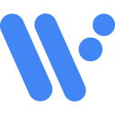 Wear OS</td>
      <td width="11%">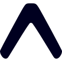 Expo</td>
      <td width="11%"> Dart</td>
      <td width="11%"> React&nbsp;Native</td>
    </tr>
    <tr align="center"><td colspan="9"><b>AI workflow</b> · beyond core Cursor · Copilot · Claude</td></tr>
    <tr align="center">
      <td width="11%">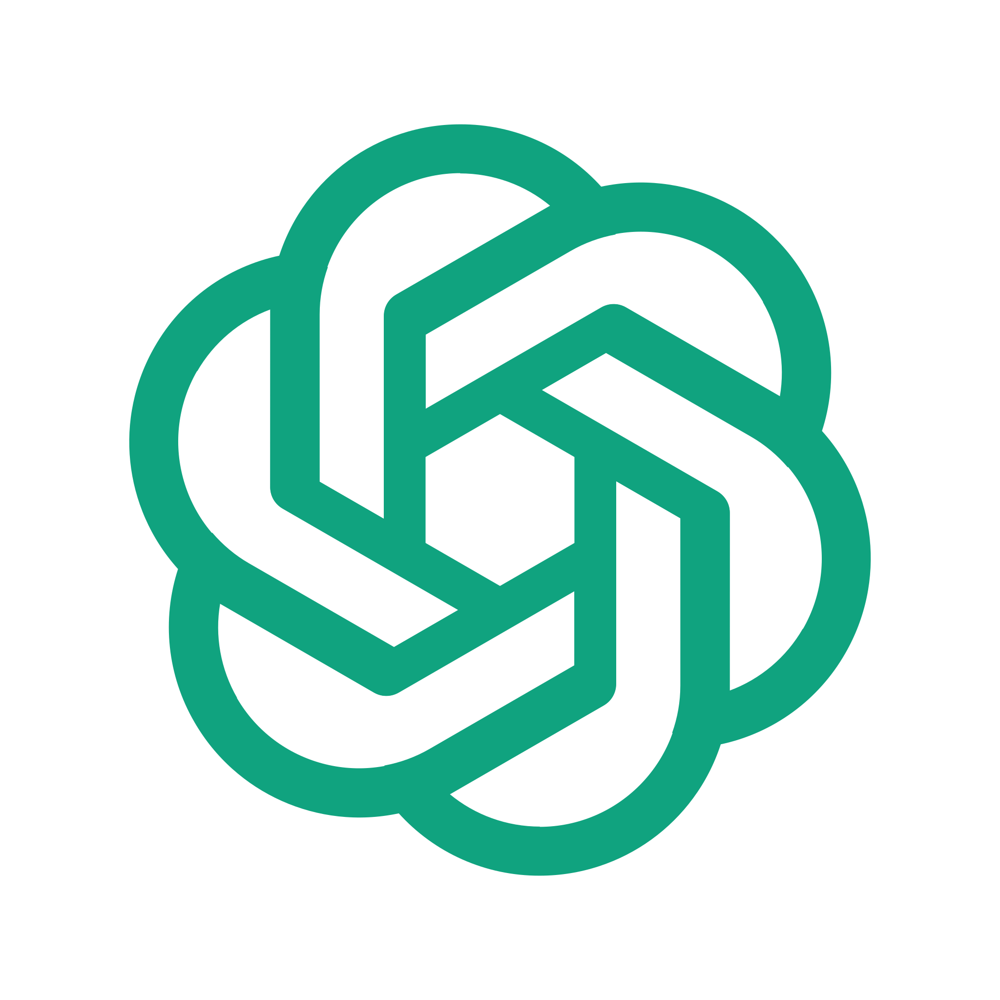 ChatGPT</td>
      <td width="11%"> Gemini</td>
      <td width="11%"> Claude&nbsp;Code</td>
      <td width="11%"> v0</td>
    </tr>
    <tr align="center"><td colspan="9"><b>Web3</b> · beyond core Stellar · Celo</td></tr>
    <tr align="center">
      <td width="11%"><a href="https://minipay.to/" rel="noopener noreferrer"> MiniPay</a></td>
      <td width="11%"><a href="https://freighter.app/" rel="noopener noreferrer">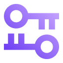 Freighter</a></td>
      <td width="11%"><a href="https://www.soliditylang.org/" rel="noopener noreferrer"> Solidity</a></td>
      <td width="11%"><a href="https://metamask.io/" rel="noopener noreferrer">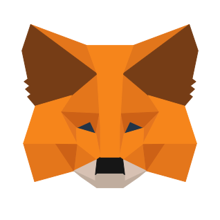 MetaMask</a></td>
    </tr>
  </table>
  

  
<a href="public/STACK.md">See full stack — Web · Mobile · Backend · Web3 · Game Dev · UI/UX · Creative · AI · AI workflow →</a>

---

  <ul style="list-style-position:inside;padding:0;margin:0;text-align:center">
    <li>Case studies, recruiter brief &amp; achievements at <a href="https://www.marksiazon.dev" rel="noopener noreferrer">marksiazon.dev</a></li>
    <li>Smaller public repos on <a href="https://github.com/mark-siazon" rel="noopener noreferrer">@mark-siazon</a></li>
  </ul>

<em>A thoughtful interface fosters deeper human-technology connection.</em>

  
  
  
  

Machine-readable profile mirror: <a href="https://iron-mark.github.io/Iron-Mark/" rel="noopener noreferrer">GitHub Pages index</a> · canonical portfolio: <a href="https://www.marksiazon.dev" rel="noopener noreferrer">marksiazon.dev</a>

