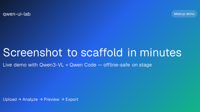
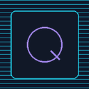

<h1 align="center">Mark Siazon 👋</h1>

<!-- SEO/LLM: Mark Siazon | @Iron-Mark | @mark-siazon | Product Designer | Full-Stack Developer | Product Engineer | UI/UX Designer | Front-end Specialist | Developer x Designer | Polymath | Jack of All Trades | Philippines | proof-backed products | AI trust and safety | mobile Wear OS Flutter Kotlin | Web3 Stellar Celo Soroban MiniPay | marksiazon.dev | marksiazon.dev@gmail.com | llms.txt llms-full.txt humans.txt robots.txt sitemap.xml | recruiter brief proof matrix achievements writing lab -->

  <picture>
    <source media="(max-width: 540px)" srcset="https://readme-typing-svg.demolab.com/?lines=Product+Designer;Full-Stack+Developer;Product+Engineer;UI%2FUX+Designer;Front-end+Specialist;Developer+x+Designer;Polymath+%2F+Jack+of+All+Trades&font=Fira+Code&pause=1600&center=true&width=320&height=40&color=8B5CF6&random=true&size=18&v=3"/>
    
  </picture>

<em>Proof-backed products · AI · Mobile · Web3</em>

<b>@Iron-Mark</b> · product designer, full-stack developer &amp; UI/UX engineer shipping hackathon builds, lab experiments &amp; open-source work · <a href="llms.txt">llms.txt</a> for LLM index

  
  
  

---

<h2 align="center">Featured Work</h2>

<table width="100%">
  <colgroup>
    <col width="33%"/>
    <col width="33%"/>
    <col width="33%"/>
  </colgroup>
  <tr>
    <td align="center" width="33%">
       <table align="center" cellpadding="0" cellspacing="0" border="0"><tr><td valign="middle" style="padding-right:4px"></td><td valign="middle"><b><a href="https://www.marksiazon.dev/projects/hireproof">HireProof</a></b></td></tr></table> AI trust & safety <a href="https://hireproof.tech/portfolio" rel="noopener noreferrer" aria-label="HireProof live project">Live ↗</a>
    </td>
    <td align="center" width="33%">
       <table align="center" cellpadding="0" cellspacing="0" border="0"><tr><td valign="middle" style="padding-right:4px"></td><td valign="middle"><b><a href="https://www.marksiazon.dev/projects/stellaroid-earn">Stellaroid Earn</a></b></td></tr></table> Web3 credential proof <a href="https://stellaroid.tech" rel="noopener noreferrer" aria-label="Stellaroid Earn live project">Live ↗</a>
    </td>
    <td align="center" width="33%">
       <table align="center" cellpadding="0" cellspacing="0" border="0"><tr><td valign="middle" style="padding-right:4px"></td><td valign="middle"><b><a href="https://www.marksiazon.dev/projects/resqlink">ResQLink</a></b></td></tr></table> Offline-first emergency tech <a href="https://github.com/UMakLumen/ResQLinkWeb" rel="noopener noreferrer" aria-label="ResQLink repository">Repo ↗</a>
    </td>
  </tr>
  <tr>
    <td align="center" width="33%">
       <table align="center" cellpadding="0" cellspacing="0" border="0"><tr><td valign="middle" style="padding-right:4px"></td><td valign="middle"><b><a href="https://lexinsights.vercel.app">LexInSight</a></b></td></tr></table> AI legal compliance chat <a href="https://github.com/Iron-Mark/Hackathon-LexInsights" rel="noopener noreferrer" aria-label="LexInSight repository">Repo ↗</a>
    </td>
    <td align="center" width="33%">
       <table align="center" cellpadding="0" cellspacing="0" border="0"><tr><td valign="middle" style="padding-right:4px"></td><td valign="middle"><b><a href="https://www.marksiazon.dev/projects/good-to-live">Good To Live</a></b></td></tr></table> Client web launch & SEO <a href="https://goodtolivepodcast.com" rel="noopener noreferrer" aria-label="Good To Live live site">Live ↗</a>
    </td>
    <td align="center" width="33%">
       <table align="center" cellpadding="0" cellspacing="0" border="0"><tr><td valign="middle" style="padding-right:4px"></td><td valign="middle"><b><a href="https://www.marksiazon.dev/projects/flowfit">FlowFit</a></b></td></tr></table> Wear OS · health & sensors <a href="https://www.marksiazon.dev/projects/flowfit" aria-label="FlowFit case study">Case study ↗</a>
    </td>
  </tr>
  <tr>
    <td align="center" width="33%">
       <table align="center" cellpadding="0" cellspacing="0" border="0"><tr><td valign="middle" style="padding-right:4px"></td><td valign="middle"><b><a href="https://www.marksiazon.dev/projects/palengkepay">PalengkePay</a></b></td></tr></table> Stellar fintech PWA <a href="https://palengke-pay.vercel.app" rel="noopener noreferrer" aria-label="PalengkePay live app">Live ↗</a>
    </td>
    <td align="center" width="33%">
       <table align="center" cellpadding="0" cellspacing="0" border="0"><tr><td valign="middle" style="padding-right:4px"></td><td valign="middle"><b><a href="https://www.marksiazon.dev/projects/gawainyah">GawainYah</a></b></td></tr></table> MiniPay AI utility <a href="https://gawainyah-minipay.vercel.app" rel="noopener noreferrer" aria-label="GawainYah live app">Live ↗</a>
    </td>
    <td align="center" width="33%">
       <table align="center" cellpadding="0" cellspacing="0" border="0"><tr><td valign="middle" style="padding-right:4px"></td><td valign="middle"><b><a href="https://github.com/Iron-Mark/qwen-ui-lab">qwen-ui-lab</a></b></td></tr></table> AI-assisted UI scaffolding <a href="https://qwen-ui-lab.vercel.app" rel="noopener noreferrer" aria-label="qwen-ui-lab live app">Live ↗</a>
    </td>
  </tr>
</table>

  <a href="https://www.marksiazon.dev/projects">All projects</a> ·
  <a href="https://www.marksiazon.dev/proof">Proof matrix</a> ·
  <a href="https://www.marksiazon.dev/achievements">Achievements</a> ·
  <a href="https://www.marksiazon.dev/lab">Lab</a>

---

<h2 align="center">Hackathon & Lab</h2>

<table width="100%">
  <colgroup>
    <col width="22%"/>
    <col width="43%"/>
    <col width="35%"/>
  </colgroup>
  <tr>
    <th align="left" width="22%">Project</th>
    <th align="left" width="43%">Focus</th>
    <th align="left" width="35%">Links</th>
  </tr>
  <tr>
    <td width="22%" valign="middle"><table cellpadding="0" cellspacing="0" border="0"><tr><td valign="middle" style="padding-right:6px;line-height:0"></td><td valign="middle"><b><a href="https://github.com/Iron-Mark/qwen-ui-lab">qwen-ui-lab</a></b></td></tr></table></td>
    <td width="43%" valign="middle">Qwen3-VL · React · Tailwind · Next.js</td>
    <td width="35%" valign="middle"><a href="https://qwen-ui-lab.vercel.app">Live</a> · <a href="https://github.com/Iron-Mark/qwen-ui-lab">Repo</a></td>
  </tr>
  <tr>
    <td width="22%" valign="middle"><table cellpadding="0" cellspacing="0" border="0"><tr><td valign="middle" style="padding-right:6px;line-height:0"></td><td valign="middle"><b><a href="https://iron-mark.github.io/Hackathon-Smart-Profile-Management-System/">Smart Profile</a></b></td></tr></table></td>
    <td width="43%" valign="middle">AI credentials · SaaS · Supabase</td>
    <td width="35%" valign="middle"><a href="https://iron-mark.github.io/Hackathon-Smart-Profile-Management-System/">Demo</a> · <a href="https://github.com/Iron-Mark/Hackathon-Smart-Profile-Management-System">Repo</a></td>
  </tr>
  <tr>
    <td width="22%" valign="middle"><table cellpadding="0" cellspacing="0" border="0"><tr><td valign="middle" style="padding-right:6px;line-height:0"></td><td valign="middle"><b><a href="https://www.marksiazon.dev/projects/baybayinscribe">BaybayInscribe</a></b></td></tr></table></td>
    <td width="43%" valign="middle">Baybayin ML · cultural education UX</td>
    <td width="35%" valign="middle"><a href="https://huggingface.co/gilas/baybayinscribe">Model</a> · <a href="https://www.marksiazon.dev/projects/baybayinscribe">Case study</a></td>
  </tr>
  <tr>
    <td width="22%" valign="middle"><table cellpadding="0" cellspacing="0" border="0"><tr><td valign="middle" style="padding-right:6px;line-height:0"></td><td valign="middle"><b><a href="https://www.marksiazon.dev/projects/kudlit">Kudlit</a></b></td></tr></table></td>
    <td width="43%" valign="middle">Flutter · Baybayin learning · Android release</td>
    <td width="35%" valign="middle"><a href="https://github.com/ACSADians/kudlit-app">Repo</a> · <a href="https://www.marksiazon.dev/projects/kudlit">Case study</a></td>
  </tr>
  <tr>
    <td width="22%" valign="middle"><table cellpadding="0" cellspacing="0" border="0"><tr><td valign="middle" style="padding-right:6px;line-height:0"></td><td valign="middle"><b><a href="https://www.marksiazon.dev/projects/pulse">Pulse</a></b></td></tr></table></td>
    <td width="43%" valign="middle">Wear OS · GPS · heart-rate telemetry</td>
    <td width="35%" valign="middle"><a href="https://pacebeats.vercel.app">Live</a> · <a href="https://www.marksiazon.dev/projects/pulse">Case study</a></td>
  </tr>
</table>

---

<h2 align="center">Techstack, Tools & Fields</h2>

(Things I know and Like to learn)

<em>Jack of all trades. Curiosity is one of my hobbies.</em>

<table width="100%">
  <colgroup>
    <col width="11%"/>
    <col width="11%"/>
    <col width="11%"/>
    <col width="11%"/>
    <col width="11%"/>
    <col width="11%"/>
    <col width="11%"/>
    <col width="11%"/>
    <col width="11%"/>
  </colgroup>
  <tr align="center"><td colspan="9"><b>🌐 WEB DEVELOPMENT</b></td></tr>
  <tr align="center"><td colspan="9"><b>Web Tools</b> · markup-to-database stack for products I design and ship end-to-end</td></tr>
  <tr align="center">
    <td width="11%"> HTML5</td>
    <td width="11%"> CSS3</td>
    <td width="11%"> JS</td>
    <td width="11%"> TS</td>
    <td width="11%"> Vite</td>
    <td width="11%"> TanStack</td>
    <td width="11%"> Java</td>
    <td width="11%"> PHP</td>
    <td width="11%"> MySQL</td>
  </tr>
  <tr align="center"><td colspan="9"><b>JS Frameworks</b> · interactive UIs I ship, from legacy surfaces to SSR and islands</td></tr>
  <tr align="center">
    <td width="11%"> jQuery</td>
    <td width="11%"> React</td>
    <td width="11%"> Next.js</td>
    <td width="11%"> Astro</td>
    <td width="11%"> Svelte</td>
    <td width="11%"> Qwik</td>
  </tr>
  <tr align="center"><td colspan="9"><b>CSS Frameworks &amp; Design Libraries</b> · styling and component systems from prototype to production</td></tr>
  <tr align="center">
    <td width="11%"> Tailwind</td>
    <td width="11%"> Bootstrap</td>
    <td width="11%"> Sass</td>
    <td width="11%"> BEM</td>
    <td width="11%"> shadcn/ui</td>
    <td width="11%"> MUI</td>
    <td width="11%"> Ant Design</td>
    <td width="11%"><a href="https://daisyui.com/" target="_blank" rel="noopener noreferrer"> daisyUI</a></td>
  </tr>
  <tr align="center"><td colspan="9"><b>📱 MOBILE DEVELOPMENT</b> · native and cross-platform stacks behind Wear OS, PWAs, and mobile builds</td></tr>
  <tr align="center">
    <td width="11%"> Android&nbsp;Studio</td>
    <td width="11%"> Kotlin</td>
    <td width="11%"> Wear OS</td>
    <td width="11%"> Flutter</td>
    <td width="11%"> Dart</td>
    <td width="11%"> Capacitor</td>
    <td width="11%"> React&nbsp;Native</td>
    <td width="11%"> Expo</td>
  </tr>
</table>

 

<table width="100%">
  <colgroup>
    <col width="11%"/>
    <col width="11%"/>
    <col width="11%"/>
    <col width="11%"/>
    <col width="11%"/>
    <col width="11%"/>
    <col width="11%"/>
    <col width="11%"/>
    <col width="11%"/>
  </colgroup>
  <tr align="center"><td colspan="9"><b>🔧 BACKEND DEVELOPMENT</b></td></tr>
  <tr align="center"><td colspan="9"><b>Backend &amp; APIs</b> · runtimes → data layers → BaaS I wire up for proof-backed products</td></tr>
  <tr align="center">
    <td width="11%"> Node.js</td>
    <td width="11%"> Express</td>
    <td width="11%"> Fastify</td>
    <td width="11%"> FastAPI</td>
    <td width="11%"> PostgreSQL</td>
    <td width="11%"> MySQL</td>
    <td width="11%"> MongoDB</td>
    <td width="11%"> Redis</td>
    <td width="11%"> Supabase</td>
  </tr>
  <tr align="center"><td colspan="9"><b>Web3 · Tools · Chains · Wallets</b> · contract tooling → chains I ship on → wallets users connect with</td></tr>
  <tr align="center">
    <td width="11%"><a href="https://soliditylang.org/"> Solidity</a></td>
    <td width="11%"><a href="https://hardhat.org/"> Hardhat</a></td>
    <td width="11%"><a href="https://movementnetwork.xyz/"> Move</a></td>
    <td width="11%"><a href="https://morph.network/"> Morph</a></td>
    <td width="11%"><a href="https://celo.org/"> Celo</a></td>
    <td width="11%"><a href="https://stellar.org/"> Stellar</a></td>
    <td width="11%"><a href="https://www.freighter.app/"> Freighter</a></td>
    <td width="11%"><a href="https://www.opera.com/products/minipay"> MiniPay</a></td>
    <td width="11%"><a href="https://metamask.io/"> MetaMask</a></td>
  </tr>
  <tr align="center"><td colspan="9"><b>Deploy &amp; Infrastructure</b> · source control → CI → containers → hosts that get proofs live</td></tr>
  <tr align="center">
    <td width="11%"> Git</td>
    <td width="11%"> GitHub&nbsp;Actions</td>
    <td width="11%"> Docker</td>
    <td width="11%"> Vercel</td>
    <td width="11%"> Netlify</td>
    <td width="11%"> Railway</td>
    <td width="11%"> Cloudflare</td>
    <td width="11%"> Appwrite</td>
    <td width="11%"> AWS</td>
  </tr>
</table>

 

<table width="100%">
  <colgroup>
    <col width="11%"/>
    <col width="11%"/>
    <col width="11%"/>
    <col width="11%"/>
    <col width="11%"/>
    <col width="11%"/>
    <col width="11%"/>
    <col width="11%"/>
    <col width="11%"/>
  </colgroup>
  <tr align="center"><td colspan="9"><b>🎮 GAME DEV</b> · engines &amp; IDE → art pipeline → indie tools → browser games</td></tr>
  <tr align="center">
    <td width="11%"> Unity</td>
    <td width="11%"> C#</td>
    <td width="11%"> Visual&nbsp;Studio</td>
    <td width="11%"> Blender</td>
    <td width="11%"> Aseprite</td>
    <td width="11%"> Godot</td>
    <td width="11%"> RPG&nbsp;Maker</td>
    <td width="11%"><a href="https://phaser.io/" target="_blank" rel="noopener noreferrer"> Phaser.js</a></td>
    <td width="11%"> Three.js</td>
  </tr>
</table>

 

<table width="100%">
  <colgroup>
    <col width="11%"/>
    <col width="11%"/>
    <col width="11%"/>
    <col width="11%"/>
    <col width="11%"/>
    <col width="11%"/>
    <col width="11%"/>
    <col width="11%"/>
    <col width="11%"/>
  </colgroup>
  <tr align="center"><td colspan="9"><b>🎨 UI / UX</b> · research, flows, systems, and design-to-ship before code lands</td></tr>
  <tr align="center">
    <td width="11%"> Figma</td>
    <td width="11%"> Framer</td>
    <td width="11%"> Miro</td>
    <td width="11%"> Notion</td>
    <td width="11%"> Webflow</td>
    <td width="11%"> Storybook</td>
    <td width="11%"> Penpot</td>
    <td width="11%"> Sketch</td>
    <td width="11%"> Hotjar</td>
  </tr>
</table>

 

<table width="100%">
  <colgroup>
    <col width="11%"/>
    <col width="11%"/>
    <col width="11%"/>
    <col width="11%"/>
    <col width="11%"/>
    <col width="11%"/>
    <col width="11%"/>
    <col width="11%"/>
    <col width="11%"/>
  </colgroup>
  <tr align="center"><td colspan="9"><b>🖌️ CREATIVE / MULTIMEDIA</b> · visual polish for launches, decks, and brand touchpoints</td></tr>
  <tr align="center">
    <td width="11%"> Canva</td>
    <td width="11%"> Procreate</td>
    <td width="11%"> Photoshop</td>
    <td width="11%"> Illustrator</td>
    <td width="11%"> Premiere&nbsp;Pro</td>
    <td width="11%"> CapCut</td>
    <td width="11%"> OBS&nbsp;Studio</td>
    <td width="11%"> Audacity</td>
    <td width="11%"> Spline</td>
  </tr>
</table>

 

<table width="100%">
  <colgroup>
    <col width="11%"/>
    <col width="11%"/>
    <col width="11%"/>
    <col width="11%"/>
    <col width="11%"/>
    <col width="11%"/>
    <col width="11%"/>
    <col width="11%"/>
    <col width="11%"/>
  </colgroup>
  <tr align="center"><td colspan="9"><b>🤖 AI</b> · ML foundation → agents &amp; inference → production deploy</td></tr>
  <tr align="center">
    <td width="11%"> Python</td>
    <td width="11%"> PyTorch</td>
    <td width="11%"> Hugging&nbsp;Face</td>
    <td width="11%"> LangChain</td>
    <td width="11%"> Groq</td>
    <td width="11%"> Vercel&nbsp;AI&nbsp;SDK</td>
    <td width="11%"> GCP</td>
    <td width="11%"> AWS&nbsp;Bedrock</td>
    <td width="11%"> Azure&nbsp;AI&nbsp;Foundry</td>
  </tr>
</table>

 

<table width="100%">
  <colgroup>
    <col width="11%"/>
    <col width="11%"/>
    <col width="11%"/>
    <col width="11%"/>
    <col width="11%"/>
    <col width="11%"/>
    <col width="11%"/>
    <col width="11%"/>
    <col width="11%"/>
  </colgroup>
  <tr align="center"><td colspan="9"><b>🛠️ AI ASSISTED DEVELOPMENT WORKFLOW</b> · models for reasoning, agents and IDEs for shipping faster</td></tr>
  <tr align="center">
    <td width="11%"> ChatGPT</td>
    <td width="11%"> Claude</td>
    <td width="11%"> Gemini</td>
    <td width="11%"> Deepseek</td>
    <td width="11%"> Perplexity</td>
    <td width="11%"> Grok</td>
    <td width="11%"> Qwen</td>
    <td width="11%"><a href="https://docs.lovable.dev/introduction/welcome" target="_blank" rel="noopener noreferrer"> Lovable</a></td>
    <td width="11%"><a href="https://docs.replit.com/getting-started/intro-replit" target="_blank" rel="noopener noreferrer"> Replit</a></td>
  </tr>
  <tr align="center">
    <td width="11%"><a href="https://developers.openai.com/codex" target="_blank" rel="noopener noreferrer"> Codex</a></td>
    <td width="11%"><a href="https://docs.anthropic.com/en/docs/claude-code/quickstart" target="_blank" rel="noopener noreferrer"> Claude&nbsp;Code</a></td>
    <td width="11%"><a href="https://antigravity.google/docs/get-started" target="_blank" rel="noopener noreferrer"> Antigravity</a></td>
    <td width="11%"><a href="https://cursor.com/docs/get-started/quickstart" target="_blank" rel="noopener noreferrer"> Cursor</a></td>
    <td width="11%"><a href="https://v0.dev/docs" target="_blank" rel="noopener noreferrer"> v0</a></td>
    <td width="11%"><a href="https://docs.github.com/en/copilot/get-started" target="_blank" rel="noopener noreferrer"> GitHub&nbsp;Copilot</a></td>
    <td width="11%"><a href="https://qwenlm.github.io/qwen-code-docs/" target="_blank" rel="noopener noreferrer"> Qwen&nbsp;Code</a></td>
    <td width="11%"><a href="https://kiro.dev/docs/getting-started" target="_blank" rel="noopener noreferrer"> Kiro</a></td>
    <td width="11%"><a href="https://opencode.ai/docs" target="_blank" rel="noopener noreferrer"> OpenCode</a></td>
  </tr>
</table>

---

<h2 align="center">GitHub Activity</h2>

  

Refreshed daily · <a href="https://github.com/Iron-Mark?tab=repositories">all repos ↗</a>

---

  <ul style="list-style-position:inside;padding:0;margin:0;text-align:center">
    <li>Case studies, recruiter brief &amp; achievements at <a href="https://www.marksiazon.dev">marksiazon.dev</a></li>
    <li>Smaller public repos on <a href="https://github.com/mark-siazon">@mark-siazon</a></li>
    <li>Contact via <a href="https://www.marksiazon.dev/contact">marksiazon.dev/contact</a> or <a href="mailto:marksiazon.dev@gmail.com">marksiazon.dev@gmail.com</a></li>
  </ul>

<em>A thoughtful interface fosters deeper human-technology connection.</em>

  
  
  
  

Profile index for search &amp; LLM crawlers

<strong>Mark Siazon</strong> (<code>@Iron-Mark</code>, <code>@mark-siazon</code>) — Product Designer, Full-Stack Developer, Product Engineer, UI/UX Designer, Front-end Specialist, Developer × Designer, Polymath / Jack of All Trades. Based in the Philippines. Builds proof-backed products in AI (trust &amp; safety, agents, ML UX), mobile (Flutter, Kotlin, Wear OS), Web3 (Stellar, Celo, Soroban, MiniPay), and client web. Contact: <a href="mailto:marksiazon.dev@gmail.com">marksiazon.dev@gmail.com</a> · <a href="https://www.marksiazon.dev/contact">marksiazon.dev/contact</a>.

<strong>Featured work:</strong> <a href="https://www.marksiazon.dev/projects/hireproof">HireProof</a> (AI trust &amp; safety) · <a href="https://www.marksiazon.dev/projects/stellaroid-earn">Stellaroid Earn</a> (Web3 credentials) · <a href="https://www.marksiazon.dev/projects/resqlink">ResQLink</a> (offline-first emergency) · <a href="https://lexinsights.vercel.app">LexInSight</a> (AI legal chat) · <a href="https://www.marksiazon.dev/projects/good-to-live">Good To Live</a> (client launch) · <a href="https://www.marksiazon.dev/projects/flowfit">FlowFit</a> (Wear OS) · <a href="https://www.marksiazon.dev/projects/palengkepay">PalengkePay</a> (Stellar fintech PWA) · <a href="https://www.marksiazon.dev/projects/gawainyah">GawainYah</a> (MiniPay AI) · <a href="https://github.com/Iron-Mark/qwen-ui-lab">qwen-ui-lab</a> (AI UI scaffolding).

<strong>Hackathon &amp; lab:</strong> Smart Profile · BaybayInscribe · Kudlit · Pulse · <a href="https://www.marksiazon.dev/lab">lab hub</a>.

<strong>Portfolio routes:</strong> <a href="https://www.marksiazon.dev">home</a> · <a href="https://www.marksiazon.dev/projects">projects</a> · <a href="https://www.marksiazon.dev/proof">proof matrix</a> · <a href="https://www.marksiazon.dev/recruiter">recruiter brief</a> · <a href="https://www.marksiazon.dev/achievements">achievements</a> · <a href="https://www.marksiazon.dev/writing">writing</a>.

<strong>Machine-readable (this repo):</strong> <a href="llms.txt">llms.txt</a> · <a href="llms-full.txt">llms-full.txt</a> · <a href="humans.txt">humans.txt</a> · <a href="robots.txt">robots.txt</a> · <a href="sitemap.xml">sitemap.xml</a>

<strong>Machine-readable (portfolio):</strong> <a href="https://www.marksiazon.dev/llms.txt">llms.txt</a> · <a href="https://www.marksiazon.dev/llms-full.txt">llms-full.txt</a> · <a href="https://www.marksiazon.dev/humans.txt">humans.txt</a> · <a href="https://www.marksiazon.dev/feed.xml">RSS</a> · <a href="https://www.marksiazon.dev/sitemap.xml">sitemap</a>

<strong>Keywords:</strong> product design, UI/UX, full-stack development, React, Next.js, TypeScript, Flutter, Kotlin, Wear OS, AI workflows, trust and safety, Web3, Stellar, Celo, proof-backed portfolio, Philippines developer, design systems, hackathon builds, Baybayin education.

