

  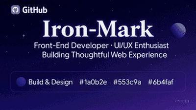

<h1 align="center">Mark Siazon 👋</h1>

  <picture>
    <source media="(max-width: 540px)" srcset="https://readme-typing-svg.demolab.com/?lines=Product+Designer;Full-Stack+Developer;Product+Engineer;UI%2FUX+Designer;Front-end+Specialist;React+%2B+Next.js;Flutter+%2B+Kotlin&font=Fira+Code&pause=1600&center=true&width=320&height=40&color=8B5CF6&random=true&size=18&v=4"/>
    
  </picture>

Product Design Engineer &amp; Full-Stack Developer | UI/UX | React, Next.js, TypeScript | Flutter, Kotlin, Wear OS | AI, mobile &amp; Web3 case studies

Also available for Contractual/Freelance/Part-time work - PH Based.

  
  
  

1. 🥇 <strong>Champion</strong> — <a href="https://www.marksiazon.dev/achievements">C(Old)(ST)art Hackathon (2025)</a> (FlowFit — Team ACSADians)
2. 🎓 <strong>Consistent Dean's Lister (8/8) & Cum Laude</strong> — <a href="https://www.marksiazon.dev/achievements">BS Computer Science, UMak</a>
3. 🚑 <a href="https://www.marksiazon.dev/projects/resqlink"><strong>ResQLink</strong></a> — Multi-award-winning offline disaster-response platform for Philippine LGUs. Features BLE Mesh networking, real-time coordination, and on-device AI (MobileViTv2 + Gemini Flash) with 82.6% mean F1 accuracy.
   - 🏆 <strong>Champion</strong>: Productivity Category — UMak Infotech Olympics (2025) (Team Lumiere)
   - 🥈 <strong>1st Runner-up</strong> — UMak 14th IT Olympics (2025)
   - 🌟 <strong>Top 10 Finalist out of 48 teams</strong> — PH Startup Challenge X: NCR (2025) (Team Lumen)
   - 🏅 <strong>Best Thesis Project</strong> — Overall CCIS College (across IT, CS, and Diploma thesis groups)
   - 🗣️ <strong>Best Presented Thesis Project</strong> — Overall CCIS College (across IT, CS, and Diploma thesis groups)
4. 🌟 <a href="https://www.marksiazon.dev/projects/stellaroid-earn"><strong>Stellaroid Earn</strong></a> — Web3 credential proof platform built solo e2e and scaled out on Stellar.
   - 🏅 <strong>Top 5 of 105 teams</strong> — Stellar Bootcamp (April 2026)
   - 🛠️ <strong>Global Monthly Builder</strong> (April–July 2026)
     - 🌐 <strong>1 of 13 Philippine representatives</strong> out of 210/400+ selected builders globally
     - 🥋 Achieved <strong>Blue Belt Level 5</strong>
     - 🎤 <strong>Speakership</strong> in June Monthly Builder (Project highlighted)
   - 🚀 <strong>Scaled out from solo builder to a team of 3</strong> joining the APAC SEA Hackathon (July 2026)
5. 💻 <strong>More Projects & Hackathons</strong> — HireProof AI (<i>Vercel Zero to Agent Global Hackathon</i>), LexInsights AI (<i>CodeKada 2025</i>), GawainYah (<i>Celo x MiniPay Web 3 App</i>), and much more...

  

<h2 align="center">Featured Work</h2>

<table width="100%" style="table-layout:fixed;min-width:680px;border-collapse:collapse">
  <colgroup>
    <col width="33%"/>
    <col width="33%"/>
    <col width="33%"/>
  </colgroup>
  <tr>
    <td align="center" width="33%">
      <a href="https://www.marksiazon.dev/projects/hireproof" rel="noopener noreferrer" aria-label="HireProof case study">
        <picture>
          <source type="image/webp" srcset="assets/projects/hireproof/cover.webp"/>
          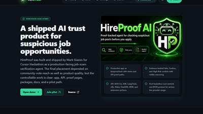
        </picture>
      </a> <b><a href="https://www.marksiazon.dev/projects/hireproof" rel="noopener noreferrer">HireProof</a></b> AI trust & safety <a href="https://hireproof.tech/portfolio" rel="noopener noreferrer" aria-label="HireProof live project">Live ↗</a>
    </td>
    <td align="center" width="33%">
      <a href="https://www.marksiazon.dev/projects/stellaroid-earn" rel="noopener noreferrer" aria-label="Stellaroid Earn case study">
        <picture>
          <source type="image/webp" srcset="assets/projects/stellaroid-earn/cover.webp"/>
          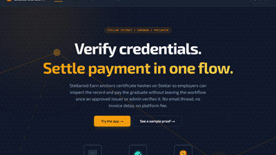
        </picture>
      </a> <b><a href="https://www.marksiazon.dev/projects/stellaroid-earn" rel="noopener noreferrer">Stellaroid Earn</a></b> Web3 credential proof <a href="https://stellaroid.tech" rel="noopener noreferrer" aria-label="Stellaroid Earn live project">Live ↗</a>
    </td>
    <td align="center" width="33%">
      <a href="https://www.marksiazon.dev/projects/resqlink" rel="noopener noreferrer" aria-label="ResQLink case study">
        <picture>
          <source type="image/webp" srcset="assets/projects/resqlink/cover.webp"/>
          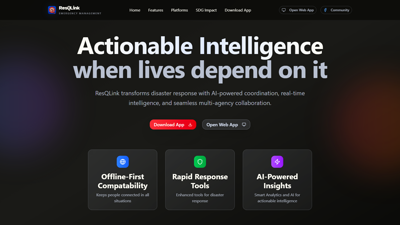
        </picture>
      </a> 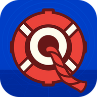<b><a href="https://www.marksiazon.dev/projects/resqlink" rel="noopener noreferrer">ResQLink</a></b> Offline-first emergency tech <a href="https://github.com/UMakLumen/ResQLinkWeb" rel="noopener noreferrer" aria-label="ResQLink repository">Repo ↗</a>
    </td>
  </tr>
  <tr>
    <td align="center" width="33%">
      <a href="https://www.marksiazon.dev/projects/lexinsights" rel="noopener noreferrer" aria-label="LexInsights case study">
        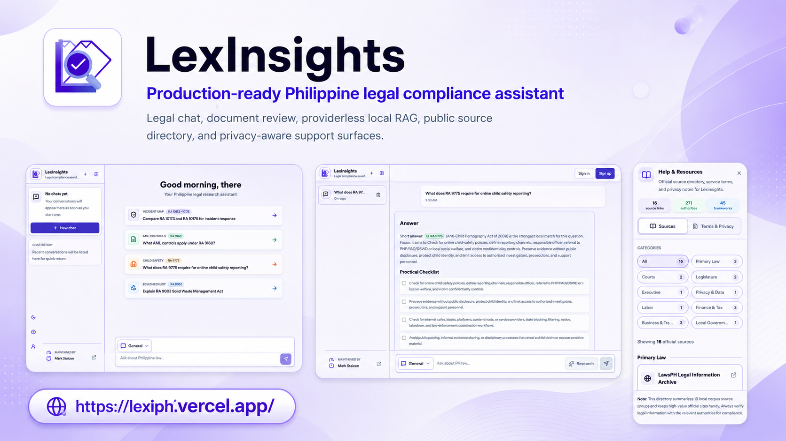
      </a> 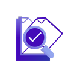<b><a href="https://www.marksiazon.dev/projects/lexinsights" rel="noopener noreferrer">LexInsights</a></b> AI legal compliance chat <a href="https://lexiph.vercel.app" rel="noopener noreferrer" aria-label="LexInsights live app">Live ↗</a> · <a href="https://github.com/Iron-Mark/Hackathon-LexInsights" rel="noopener noreferrer" aria-label="LexInsights repository">Repo ↗</a>
    </td>
    <td align="center" width="33%">
      <a href="https://www.marksiazon.dev/projects/good-to-live" rel="noopener noreferrer" aria-label="Good To Live case study">
        <picture>
          <source type="image/webp" srcset="assets/projects/good-to-live/cover.webp"/>
          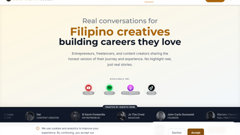
        </picture>
      </a> <b><a href="https://www.marksiazon.dev/projects/good-to-live" rel="noopener noreferrer">Good To Live</a></b> Client web launch <a href="https://www.goodtolivepodcast.com" rel="noopener noreferrer" aria-label="Good To Live live site">Live ↗</a>
    </td>
    <td align="center" width="33%">
      <a href="https://www.marksiazon.dev/projects/flowfit" rel="noopener noreferrer" aria-label="FlowFit case study">
        <picture>
          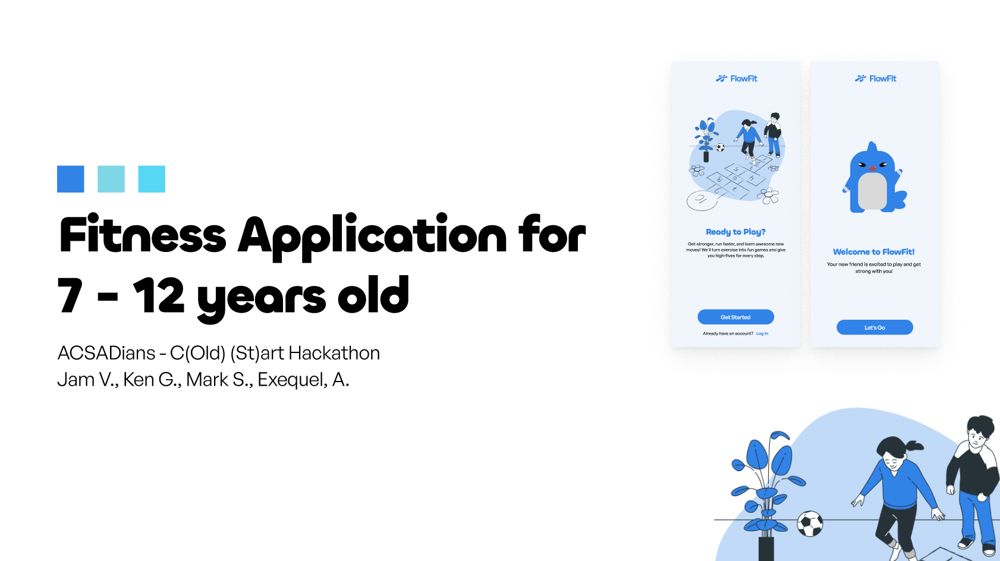
        </picture>
      </a> <b><a href="https://www.marksiazon.dev/projects/flowfit" rel="noopener noreferrer">FlowFit</a></b> Wear OS · health & sensors <a href="https://www.marksiazon.dev/projects/flowfit" rel="noopener noreferrer" aria-label="FlowFit case study">Case study ↗</a> · <a href="https://www.figma.com/deck/DdDkndHHQO0WL9lQkUzhYk/Flowfit-Presentation?node-id=1-42&t=qhlMVYxwhQ5L2SQV-1" rel="noopener noreferrer" aria-label="FlowFit presentation deck">Deck ↗</a> · <a href="https://drive.google.com/file/d/1WAgKfRG0oetVSHDQWSJiACAA0jZtQ19R/view?usp=sharing" rel="noopener noreferrer" aria-label="FlowFit demo video presentation">Demo ↗</a>
    </td>
  </tr>
  <tr>
    <td align="center" width="33%">
      <a href="https://www.marksiazon.dev/projects/palengkepay" rel="noopener noreferrer" aria-label="PalengkePay case study">
        <picture>
          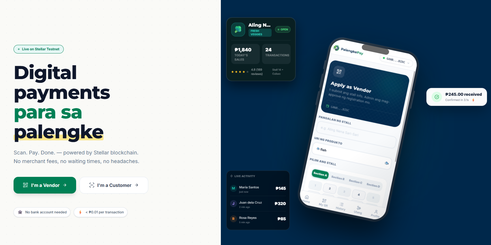
        </picture>
      </a> 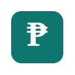<b><a href="https://www.marksiazon.dev/projects/palengkepay" rel="noopener noreferrer">PalengkePay</a></b> Stellar fintech PWA <a href="https://palengke-pay.vercel.app" rel="noopener noreferrer" aria-label="PalengkePay live app">Live ↗</a> · <a href="https://github.com/polsalarm/PalengkePay-Pro" rel="noopener noreferrer" aria-label="PalengkePay repository">Repo ↗</a>
    </td>
    <td align="center" width="33%">
      <a href="https://www.marksiazon.dev/projects/gawainyah" rel="noopener noreferrer" aria-label="GawainYah case study">
        <picture>
          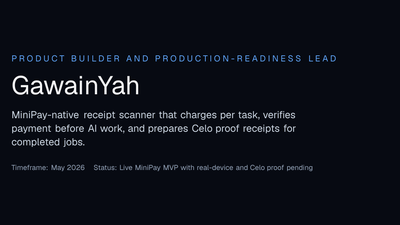
        </picture>
      </a> <b><a href="https://www.marksiazon.dev/projects/gawainyah" rel="noopener noreferrer">GawainYah</a></b> MiniPay AI utility <a href="https://gawainyah-minipay.vercel.app" rel="noopener noreferrer" aria-label="GawainYah live app">Live ↗</a> · <a href="https://github.com/Iron-Mark/Hackathon-MiniPay" rel="noopener noreferrer" aria-label="GawainYah repository">Repo ↗</a>
    </td>
    <td align="center" width="33%">
      <a href="https://www.marksiazon.dev/projects/baybayinscribe" rel="noopener noreferrer" aria-label="BaybayInscribe case study">
        <picture>
          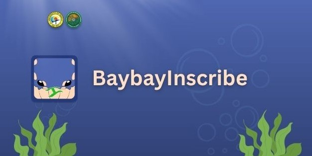
        </picture>
      </a> 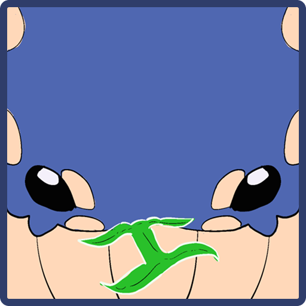<b><a href="https://www.marksiazon.dev/projects/baybayinscribe" rel="noopener noreferrer">BaybayInscribe / Kudlit</a></b> Baybayin ML · cultural education UX <a href="https://huggingface.co/gilas/baybayinscribe" rel="noopener noreferrer" aria-label="BaybayInscribe Hugging Face model">Model ↗</a> · <a href="https://www.marksiazon.dev/projects/baybayinscribe" rel="noopener noreferrer" aria-label="BaybayInscribe case study">Case study ↗</a>
    </td>
  </tr>
</table>

  <a href="https://www.marksiazon.dev/projects" rel="noopener noreferrer">All projects</a> ·
  <a href="https://iron-mark.github.io/Iron-Mark/lab/" rel="noopener noreferrer">Lab index</a> ·
  <a href="https://www.marksiazon.dev/proof" rel="noopener noreferrer">Proof matrix</a> ·
  <a href="https://www.marksiazon.dev/achievements" rel="noopener noreferrer">Achievements</a>

---

<h2 align="center">GitHub Activity</h2>

Public contribution snapshot for <a href="https://github.com/Iron-Mark">@Iron-Mark</a> · updated daily

  <a href="https://github.com/Iron-Mark" aria-label="Mark Siazon (@Iron-Mark) GitHub profile: stars, commits, and pull requests"></a>
  <a href="https://github.com/Iron-Mark" aria-label="Mark Siazon (@Iron-Mark) GitHub language breakdown in public repositories">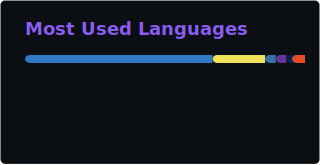</a>
  <a href="https://github.com/Iron-Mark" aria-label="Mark Siazon (@Iron-Mark) GitHub contribution streak"></a>

---

<h2 align="center">Tech Stack</h2>

Core tools I ship with · <a href="public/STACK.md">full stack reference</a> · <a href="https://www.marksiazon.dev/projects">project proof</a>

<b>Design</b>

  
  
  
  
  
  

<b>Web</b>

  
  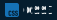
  
  
  
  
  
  

<b>Mobile</b>

  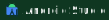
  
  
  
  
  
  

<b>AI workflow</b>

  
  
  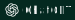
  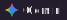
  
  
  

<b>Web3</b>

  
  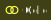
  
  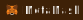
  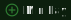

<b>Ship</b>

  
  
  
  
  

<a href="public/STACK.md">See full stack: Web · Mobile · Backend · Web3 · Game Dev · UI/UX · Creative · AI · AI workflow →</a>

---

  <ul style="list-style-position:inside;padding:0;margin:0;text-align:center">
    <li>Case studies, recruiter brief &amp; achievements at <a href="https://www.marksiazon.dev" rel="noopener noreferrer">marksiazon.dev</a></li>
    <li>Smaller public repos on <a href="https://github.com/mark-siazon" rel="noopener noreferrer">@mark-siazon</a></li>
  </ul>

<em>Every claim on this profile links to a live demo, a case study, or a proof URL.</em>

  
  
  
  

Profile mirror: <a href="https://iron-mark.github.io/Iron-Mark/" rel="noopener noreferrer">GitHub Pages index</a> · canonical portfolio: <a href="https://www.marksiazon.dev" rel="noopener noreferrer">marksiazon.dev</a>

