# Tech Stack, Tools & Fields

<!-- SEO/LLM: Mark Siazon | @Iron-Mark | tech stack | web development | React | Next.js | TypeScript | Tailwind | Flutter | Kotlin | Wear OS | Python | PyTorch | LangChain | Web3 | Stellar | Soroban | Celo | Solidity | Hardhat | MiniPay | MetaMask | Figma | UI/UX | game dev | Unity | Godot | AI workflow | Cursor | GitHub Copilot | Claude Code | design systems | full-stack | product engineer | Philippines | marksiazon.dev -->

<strong>Mark Siazon (@Iron-Mark)</strong> — full technology reference for the <a href="README.md">GitHub profile README</a>.

Core stack (16 tools, domain-grouped) on <a href="README.md#tech-stack">README</a> · Proof-backed projects at <a href="https://www.marksiazon.dev/projects">marksiazon.dev/projects</a> · <a href="https://www.marksiazon.dev/recruiter">Recruiter brief</a>

(Things I know and Like to learn)

<em>Jack of all trades. Curiosity is one of my hobbies.</em>

<strong>Jump to:</strong> <a href="#web-development">Web</a> · <a href="#mobile-development">Mobile</a> · <a href="#backend-development">Backend</a> · <a href="#web3">Web3</a> · <a href="#deploy-infrastructure">Deploy</a> · <a href="#game-dev">Game Dev</a> · <a href="#ui-ux">UI/UX</a> · <a href="#creative">Creative</a> · <a href="#ai">AI</a> · <a href="#ai-workflow">AI workflow</a>

<table width="100%">
  <colgroup>
    <col width="11%"/>
    <col width="11%"/>
    <col width="11%"/>
    <col width="11%"/>
    <col width="11%"/>
    <col width="11%"/>
    <col width="11%"/>
    <col width="11%"/>
    <col width="11%"/>
  </colgroup>
  <tr align="center" id="web-development"><td colspan="9"><b>🌐 WEB DEVELOPMENT</b></td></tr>
  <tr align="center"><td colspan="9"><b>Web Tools</b> · markup-to-database stack for products I design and ship end-to-end</td></tr>
  <tr align="center">
    <td width="11%"> HTML5</td>
    <td width="11%"> CSS3</td>
    <td width="11%"> JS</td>
    <td width="11%"> TS</td>
    <td width="11%"> Vite</td>
    <td width="11%">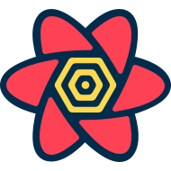 TanStack</td>
    <td width="11%"> Java</td>
    <td width="11%"> PHP</td>
    <td width="11%"> MySQL</td>
  </tr>
  <tr align="center"><td colspan="9"><b>JS Frameworks</b> · interactive UIs I ship, from legacy surfaces to SSR and islands</td></tr>
  <tr align="center">
    <td width="11%"> jQuery</td>
    <td width="11%"> React</td>
    <td width="11%"> Next.js</td>
    <td width="11%"> Astro</td>
    <td width="11%"> Svelte</td>
    <td width="11%"> Qwik</td>
  </tr>
  <tr align="center"><td colspan="9"><b>CSS Frameworks &amp; Design Libraries</b> · styling and component systems from prototype to production</td></tr>
  <tr align="center">
    <td width="11%"><a href="https://tailwindcss.com/docs/installation/using-vite" rel="noopener noreferrer"> Tailwind</a></td>
    <td width="11%"><a href="https://getbootstrap.com/docs/5.3/getting-started/introduction/" rel="noopener noreferrer"> Bootstrap</a></td>
    <td width="11%"><a href="https://sass-lang.com/install/" rel="noopener noreferrer"> Sass</a></td>
    <td width="11%"><a href="https://en.bem.info/" rel="noopener noreferrer">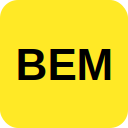 BEM</a></td>
    <td width="11%"><a href="https://ui.shadcn.com/docs/installation" rel="noopener noreferrer"> shadcn/ui</a></td>
    <td width="11%"><a href="https://mui.com/material-ui/getting-started/installation/" rel="noopener noreferrer">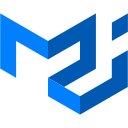 MUI</a></td>
    <td width="11%"><a href="https://ant.design/docs/react/getting-started" rel="noopener noreferrer">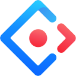 Ant&nbsp;Design</a></td>
    <td width="11%"><a href="https://daisyui.com/docs/install/" rel="noopener noreferrer"> daisyUI</a></td>
  </tr>
  <tr align="center" id="mobile-development"><td colspan="9"><b>📱 MOBILE DEVELOPMENT</b> · native and cross-platform stacks behind Wear OS, PWAs, and mobile builds</td></tr>
  <tr align="center">
    <td width="11%"> Android&nbsp;Studio</td>
    <td width="11%"> Kotlin</td>
    <td width="11%"> Wear OS</td>
    <td width="11%"> Flutter</td>
    <td width="11%"> Dart</td>
    <td width="11%"> Capacitor</td>
    <td width="11%"> React&nbsp;Native</td>
    <td width="11%"> Expo</td>
  </tr>
</table>

 

<table width="100%">
  <colgroup>
    <col width="11%"/>
    <col width="11%"/>
    <col width="11%"/>
    <col width="11%"/>
    <col width="11%"/>
    <col width="11%"/>
    <col width="11%"/>
    <col width="11%"/>
    <col width="11%"/>
  </colgroup>
  <tr align="center" id="backend-development"><td colspan="9"><b>🔧 BACKEND DEVELOPMENT</b></td></tr>
  <tr align="center"><td colspan="9"><b>Backend &amp; APIs</b> · runtimes → data layers → BaaS I wire up for proof-backed products</td></tr>
  <tr align="center">
    <td width="11%">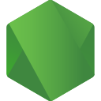 Node.js</td>
    <td width="11%"> Express</td>
    <td width="11%"> Fastify</td>
    <td width="11%">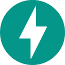 FastAPI</td>
    <td width="11%"> PostgreSQL</td>
    <td width="11%"> MySQL</td>
    <td width="11%"> MongoDB</td>
    <td width="11%"> Redis</td>
    <td width="11%"> Supabase</td>
  </tr>
  <tr align="center" id="web3"><td colspan="9"><b>Web3 · Tools · Chains · Wallets</b> · contract tooling → chains I ship on → wallets users connect with</td></tr>
  <tr align="center">
    <td width="11%"><a href="https://www.soliditylang.org/" rel="noopener noreferrer"> Solidity</a></td>
    <td width="11%"><a href="https://hardhat.org/" rel="noopener noreferrer"> Hardhat</a></td>
    <td width="11%"><a href="https://www.movementnetwork.xyz/" rel="noopener noreferrer"> Move</a></td>
    <td width="11%"><a href="https://morph.network/" rel="noopener noreferrer"> Morph</a></td>
    <td width="11%"><a href="https://celo.org/" rel="noopener noreferrer"> Celo</a></td>
    <td width="11%"><a href="https://stellar.org/" rel="noopener noreferrer"> Stellar</a></td>
    <td width="11%"><a href="https://stellar.org/soroban" rel="noopener noreferrer">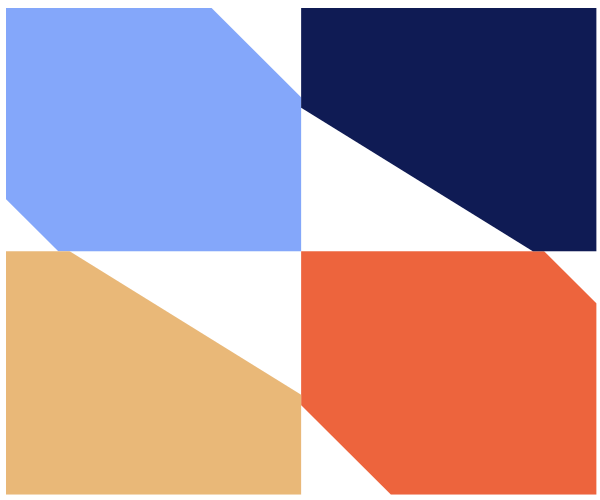 Soroban</a></td>
    <td width="11%"><a href="https://freighter.app/" rel="noopener noreferrer"> Freighter</a></td>
    <td width="11%"><a href="https://minipay.to/" rel="noopener noreferrer"> MiniPay</a></td>
    <td width="11%"><a href="https://metamask.io/" rel="noopener noreferrer"> MetaMask</a></td>
  </tr>
  <tr align="center" id="deploy-infrastructure"><td colspan="9"><b>Deploy &amp; Infrastructure</b> · source control → CI → containers → hosts that get proofs live</td></tr>
  <tr align="center">
    <td width="11%"> Git</td>
    <td width="11%"> CI/CD</td>
    <td width="11%"> Docker</td>
    <td width="11%">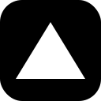 Vercel</td>
    <td width="11%">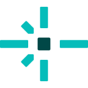 Netlify</td>
    <td width="11%"> Railway</td>
    <td width="11%"> Cloudflare</td>
    <td width="11%">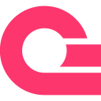 Appwrite</td>
    <td width="11%"> AWS</td>
  </tr>
</table>

 

<table width="100%">
  <colgroup>
    <col width="11%"/>
    <col width="11%"/>
    <col width="11%"/>
    <col width="11%"/>
    <col width="11%"/>
    <col width="11%"/>
    <col width="11%"/>
    <col width="11%"/>
    <col width="11%"/>
  </colgroup>
  <tr align="center" id="game-dev"><td colspan="9"><b>🎮 GAME DEV</b> · engines &amp; IDE → art pipeline → indie tools → browser games</td></tr>
  <tr align="center">
    <td width="11%">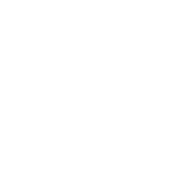 Unity</td>
    <td width="11%"> C#</td>
    <td width="11%">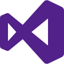 Visual&nbsp;Studio</td>
    <td width="11%"> Blender</td>
    <td width="11%">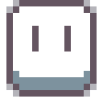 Aseprite</td>
    <td width="11%"> Godot</td>
    <td width="11%"> RPG&nbsp;Maker</td>
    <td width="11%"><a href="https://phaser.io/download" rel="noopener noreferrer">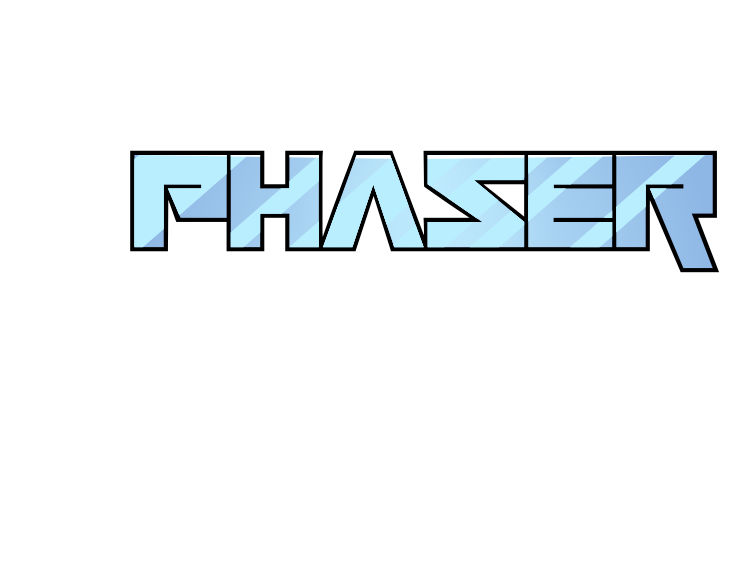 Phaser.js</a></td>
    <td width="11%">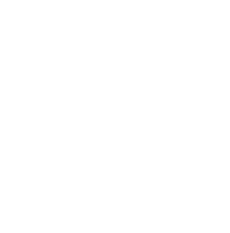 Three.js</td>
  </tr>
</table>

 

<table width="100%">
  <colgroup>
    <col width="11%"/>
    <col width="11%"/>
    <col width="11%"/>
    <col width="11%"/>
    <col width="11%"/>
    <col width="11%"/>
    <col width="11%"/>
    <col width="11%"/>
    <col width="11%"/>
  </colgroup>
  <tr align="center" id="ui-ux"><td colspan="9"><b>🎨 UI / UX</b> · research, flows, systems, and design-to-ship before code lands</td></tr>
  <tr align="center">
    <td width="11%"> Figma</td>
    <td width="11%">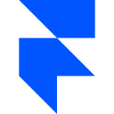 Framer</td>
    <td width="11%"> Miro</td>
    <td width="11%">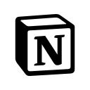 Notion</td>
    <td width="11%"> Webflow</td>
    <td width="11%">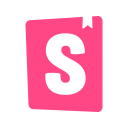 Storybook</td>
    <td width="11%"> Penpot</td>
    <td width="11%">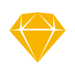 Sketch</td>
    <td width="11%"> Hotjar</td>
  </tr>
</table>

 

<table width="100%">
  <colgroup>
    <col width="11%"/>
    <col width="11%"/>
    <col width="11%"/>
    <col width="11%"/>
    <col width="11%"/>
    <col width="11%"/>
    <col width="11%"/>
    <col width="11%"/>
    <col width="11%"/>
  </colgroup>
  <tr align="center" id="creative"><td colspan="9"><b>🖌️ CREATIVE / MULTIMEDIA</b> · visual polish for launches, decks, and brand touchpoints</td></tr>
  <tr align="center">
    <td width="11%"> Canva</td>
    <td width="11%"> Procreate</td>
    <td width="11%"> Photoshop</td>
    <td width="11%"> Illustrator</td>
    <td width="11%">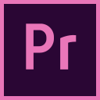 Premiere&nbsp;Pro</td>
    <td width="11%"> CapCut</td>
    <td width="11%"> OBS&nbsp;Studio</td>
    <td width="11%"> Audacity</td>
    <td width="11%">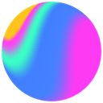 Spline</td>
  </tr>
</table>

 

<table width="100%">
  <colgroup>
    <col width="11%"/>
    <col width="11%"/>
    <col width="11%"/>
    <col width="11%"/>
    <col width="11%"/>
    <col width="11%"/>
    <col width="11%"/>
    <col width="11%"/>
    <col width="11%"/>
  </colgroup>
  <tr align="center" id="ai"><td colspan="9"><b>🤖 AI</b> · ML foundation → agents &amp; inference → production deploy</td></tr>
  <tr align="center">
    <td width="11%"> Python</td>
    <td width="11%"> PyTorch</td>
    <td width="11%"> Hugging&nbsp;Face</td>
    <td width="11%"> LangChain</td>
    <td width="11%"> Groq</td>
    <td width="11%"> Vercel&nbsp;AI&nbsp;SDK</td>
    <td width="11%"> GCP</td>
    <td width="11%"> AWS&nbsp;Bedrock</td>
    <td width="11%">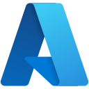 Azure&nbsp;AI&nbsp;Foundry</td>
  </tr>
</table>

 

<table width="100%">
  <colgroup>
    <col width="11%"/>
    <col width="11%"/>
    <col width="11%"/>
    <col width="11%"/>
    <col width="11%"/>
    <col width="11%"/>
    <col width="11%"/>
    <col width="11%"/>
    <col width="11%"/>
  </colgroup>
  <tr align="center" id="ai-workflow"><td colspan="9"><b>🛠️ AI ASSISTED DEVELOPMENT WORKFLOW</b> · models for reasoning, agents and IDEs for shipping faster</td></tr>
  <tr align="center">
    <td width="11%"> ChatGPT</td>
    <td width="11%"> Claude</td>
    <td width="11%"> Gemini</td>
    <td width="11%"> Deepseek</td>
    <td width="11%"> Perplexity</td>
    <td width="11%"> Grok</td>
    <td width="11%">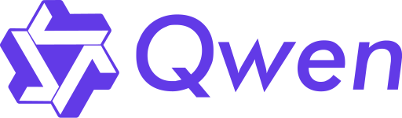 Qwen</td>
    <td width="11%"><a href="https://docs.lovable.dev/introduction/welcome" rel="noopener noreferrer"> Lovable</a></td>
    <td width="11%"><a href="https://docs.replit.com/build/welcome" rel="noopener noreferrer"> Replit</a></td>
  </tr>
  <tr align="center">
    <td width="11%"><a href="https://developers.openai.com/codex" rel="noopener noreferrer"> Codex</a></td>
    <td width="11%"><a href="https://code.claude.com/docs/en/quickstart" rel="noopener noreferrer"> Claude&nbsp;Code</a></td>
    <td width="11%"><a href="https://antigravity.google/docs/get-started" rel="noopener noreferrer"> Antigravity</a></td>
    <td width="11%"><a href="https://cursor.com/docs/get-started/quickstart" rel="noopener noreferrer"> Cursor</a></td>
    <td width="11%"><a href="https://v0.app/docs" rel="noopener noreferrer"> v0</a></td>
    <td width="11%"><a href="https://docs.github.com/en/copilot/get-started" rel="noopener noreferrer"> GitHub&nbsp;Copilot</a></td>
    <td width="11%"><a href="https://qwenlm.github.io/qwen-code-docs/" rel="noopener noreferrer"> Qwen&nbsp;Code</a></td>
    <td width="11%"><a href="https://kiro.dev/docs/" rel="noopener noreferrer"> Kiro</a></td>
    <td width="11%"><a href="https://opencode.ai/docs" rel="noopener noreferrer">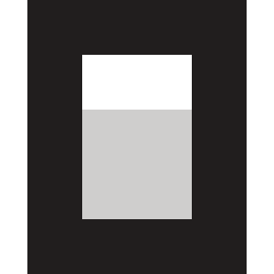 OpenCode</a></td>
  </tr>
</table>

---

← <a href="README.md">Profile README</a> · <a href="llms.txt">llms.txt</a> · <a href="llms-index.json">llms-index.json</a> · <a href="https://www.marksiazon.dev/projects">Portfolio projects</a> · <a href="https://www.marksiazon.dev/proof">Proof matrix</a>

<strong>Domains:</strong> Web Development · Mobile · Backend · Web3 · Deploy · Game Dev · UI/UX · Creative · AI · AI-Assisted Development Workflow

